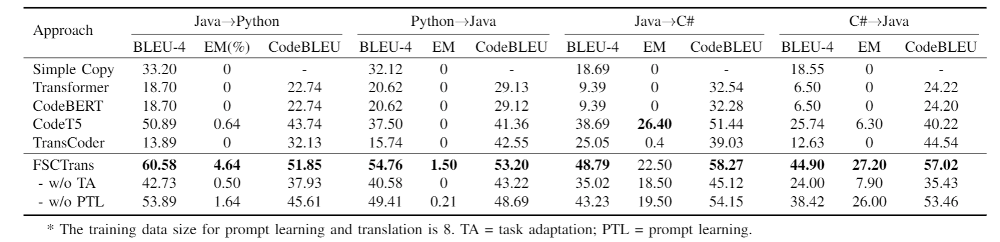

# Few-Shot Code Translation with Prompt Learning


**Introduction**

Code translation, namely, translating source code written
in one language to another, has become an emerging and rapidly growing technology in software engineering. Software is often developed for multiple platforms, requiring the same function to be written in different programming languages. Migrating a codebase to a new language can greatly facilitate multilingual development. However, manually porting code
to another language is tedious and expensive. For example, migrating the COBOL-based platform of the Commonwealth Bank of Australia to Java lasted for 5 years and cost around 750 million dollars [1]. As such, automated code translation is strongly demanded.


Traditional code translation is implemented using manually defined grammar rewriting rules [2]. Since manual rule def-
inition requires massive work from experts, researchers have
proposed deep code translation utilizing deep neural networks (DNN). For example, Chen et al. [3] leverages the LSTM
sequence-to-sequence model to translate programs.


A major challenge for deep code translation is the lack of parallel code pairs. Unlike natural languages, which have
tens of millions of parallel resources (e.g., the OPUS-100 [4]
contains 55M parallel texts in 99 language pairs), there are few parallel datasets for programming languages. Collecting
parallel code is much more costly and laborious. There are
only a small number of projects in GitHub that have multilin-
gual releases. Given such multilingual projects, it still needs manual labeling of functions between two languages. For
example, the state-of-the-art benchmark for code translation in CodeXGLUE [5] only contains 10,000 Java-C# parallel codes that was extracted from four bilingual projects, including Lucene [6], POI [7], JGit [8], and Antlr [9]. This is even more challenging in domain-specific or newly-created languages where parallel resources can hardly be obtained.


Recently, pre-trained language models (PLMs) [10]–[13] have achieved a great success in natural language processing (NLP). Inspired by those works, researchers have proposed a series of pre-trained models for source code, e.g., Code-BERT [14] and CodeT5 [15]. These PLMs have demonstrated promising results for code translation. By pre-training on large-scale monolingual code corpus, PLMs learn general pro-gramming knowledge and then are fine-tuned with small-scale parallel code corpus to adapt to code translation. For example, CodeT5 employs an encoder-decoder architecture where code in the source language is encoded into hidden states through a Transformer [16] encoder and then decoded into code in the target language through a Transformer decoder.


However, applying PLMs to code translation is notably chal-lenging due to the heterogeneity between the pre-training and the downstream translation tasks. For example, CodeT5 is pre-trained on four objectives, including masked span prediction, identifier tagging, masked identifier prediction, and bimodal dual generation. However, none of them is directly correlated to the translation task (i.e., code-to-code generation). In other words, CodeT5 has never seen code-to-code data samples during pre-training. As a result, PLMs still need to be fine-tuned on a considerable amount of translation data in order to fit the translation task. To the best of our knowledge, there is only a small number of language pairs, such as Java-C# in CodeXGLUE [5] and CoffeeScript-JavaScript [3] that have large parallel datasets for training a PLM-based code translation model. This significantly restricts the practicality of PLMs in code translation.


In this paper, we present FSCTrans, a novel few-shot learning based approach for low-resource code translation. FSCTrans is built upon CodeT5 [15], the state-of-the-art code PLM. FSCTrans adapts the CodeT5 to few-shot code translation via prompt learning. First, FSCTrans adapts the parallel code translation task to the monolingual pre-training tasks of CodeT5 using prefix language modeling. In order to transfer the pre-trained CodeT5 to scarce code translation data, FSCTrans leverages the prompt learning method, which only updates the parameters in the prompt module while freezing the entire CodeT5 model to retain the knowledge learned during pre-training.
To evaluate our approach, we build a few-shot code transla-tion dataset that involves four translations (i.e., Java→Pytyhon, Python→Java, Java→C#, and C#→Java) from real-world projects and online judge problems [17]. We compare our approach with five baseline approaches, including simple copy, Transformer, CodeBERT, CodeT5, and TransCoder. Experi-mental results show that FSCTrans remarkably outperforms the state-of-the-art code translation models in few-shot set-tings. For example, FSCTrans achieves a BLEU score of 44.9, which is 74.4% greater than CodeT5 (BLEU = 25.74) in C#→Java translation.

Our contributions can be summarized as:
- We propose a novel few-shot code translation approach using prompt learning.
- We propose a task adaption method to bridge the gap between the PLM and the translation task.
- We evaluate our approach on a few-shot parallel codebase collected from real projects and online judge problems. Experiments have shown that our approach outperforms the state-of-the-art methods by a remarkable margin.


**Usage**

Train/valid/test data is under [data_sample_8](data_sample_8/translate/). Source code for our prompt learning module is in [model.py](models.py). Source code for training is in [run_gen_prefix.py](sh/run_gen_prefix.py)

Go to the 'sh' folder, take the python->java translation as example,


Fine-tuning on the original codeT5:
```
python run_exp_softprompt.py --model_tag codet5_base --task translate --sub_task python-java --gpu 0 --gradient_accumulation_steps 1 --filename_end fewshot_8_LeetcodeData_finetune --prompt_len 0 --prompt_type 3 --few_shot 8 --patience 300 --epoch 10000
```


Directly prompt learning on the original codeT5:
```
python run_exp_softprompt.py --model_tag codet5_base --task translate --sub_task python-java --gpu 0 --gradient_accumulation_steps 1 --filename_end fewshot_8_LeetcodeData_prefix --prompt_len 100 --prompt_type 3 --few_shot 8 --patience 300 --epoch 10000
```


FSCTrans:
```
python run_exp_softprompt.py --model_tag codet5_base --task translate --sub_task python-java --gpu 0 --gradient_accumulation_steps 1 --filename_end fewshot_8_LeetcodeData_FSCT --prompt_len 100 --prompt_type 3 --few_shot 8 --patience 300 --epoch 10000 --LMadaption 2
```


**Main Results**


