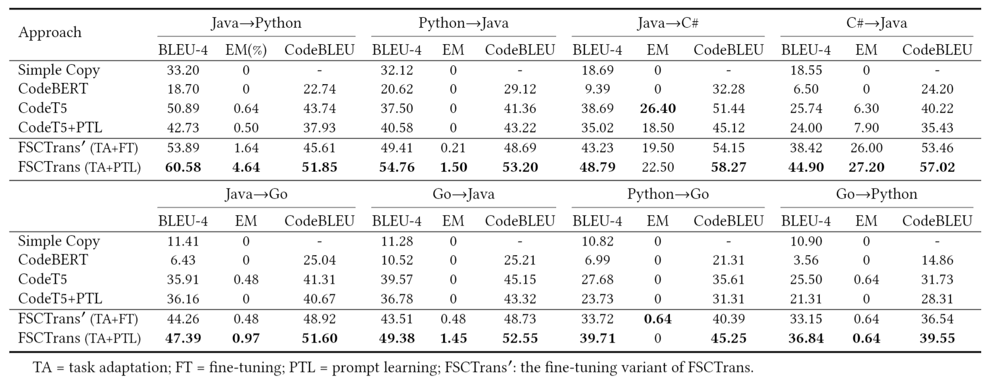

**Few-Shot Code Translation with Prompt Learning**
**Abstract**: 
Code translation has long been suffering from scarce parallel code corpora. Recently, pre-trained code models such as CodeBERT and CodeT5 have shown promising results in code translation. However, fine-tuning a PLM for code translation requires large-scale parallel data due to the heterogeneity between pre-training and downstream translation tasks. This is even more challenging in a few-shot setting where large PLMs can overfit the scarce parallel data. In this paper, we propose FSCTrans, a novel few-shot learning approach for code translation. FSCTrans is designed based onCodeT5. Unlike CodeT5, which directly fine-tunes a code translation model on limited parallel code, FSCTrans adapts pre-training tasks to the translation task through the prefix language model. To efficiently reuse prior knowledge in the pre-training phase, we employ prompt-based learning, which freezes the pre-trained CodeT5while merely updating parameters in a small prompt module. We evaluate our approach on a few-shot parallel codebase collected from real projects and LeetCode. Results have shown that FSCTrans is remarkably effective in few-shot code translation.


**Usage**
Go to 'sh' folder, take python->go translation as example,
fine-tune on the original codeT5:
```
python run_exp_softprompt.py --model_tag codet5_base --task translate --sub_task python-go --gpu 0 --gradient_accumulation_steps 1 --filename_end fewshot_8_LeetcodeData_finetune --prompt_len 0 --prompt_type 3 --few_shot 8 --patience 300 --epoch 10000
```
directly prefix tuning on the original codeT5:
```
python run_exp_softprompt.py --model_tag codet5_base --task translate --sub_task python-go --gpu 0 --gradient_accumulation_steps 1 --filename_end fewshot_8_LeetcodeData_prefix --prompt_len 100 --prompt_type 3 --few_shot 8 --patience 300 --epoch 10000
```
FSCT:
```
python run_exp_softprompt.py --model_tag codet5_base --task translate --sub_task python-go --gpu 0 --gradient_accumulation_steps 1 --filename_end fewshot_8_LeetcodeData_FSCT --prompt_len 100 --prompt_type 3 --few_shot 8 --patience 300 --epoch 10000 --LMadaption 2

```

**Main Results**


