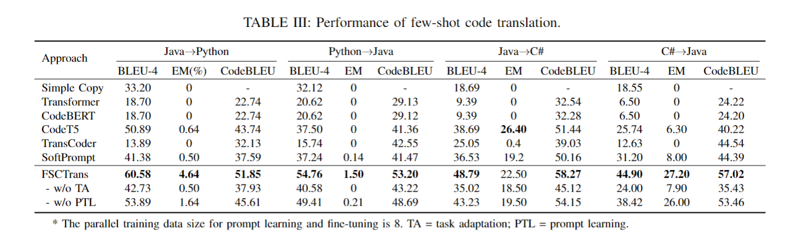

# Few-Shot Code Translation via Prompt Learning

This replication package for our paper “Few-Shot Code Translation via Prompt Learning” includes source code of our model, dataset and results. We hope this artifact can motivate and help future research on code translation and prompt learning.


**Introduction**

We present FSCTrans, a novel few-shot learning based approach for low-resource code translation. FSCTrans is built upon [CodeT5](https://github.com/salesforce/CodeT5), the state-of-the-art code PLM. FSCTrans adapts the CodeT5 to few-shot code translation via prompt learning. First, FSCTrans adapts the parallel code translation task to the monolingual pre-training tasks of CodeT5 using prefix language modeling. In order to transfer the pre-trained CodeT5 to scarce code translation data, FSCTrans leverages the prompt learning method, which only updates the parameters in the prompt module while freezing the entire CodeT5 model to retain the knowledge learned during pre-training.
To evaluate our approach, we build a few-shot code transla-tion dataset that involves four translations (i.e., Java→Pytyhon, Python→Java, Java→C#, and C#→Java) from real-world projects and online judge problems. We compare our approach with six baseline approaches, including simple copy, Transformer, CodeBERT, CodeT5, TransCoder and Softprompt. Experimental results show that FSCTrans remarkably outperforms the state-of-the-art code translation models in few-shot set-tings. For example, FSCTrans achieves a BLEU score of 44.9, which is 74.4% greater than CodeT5 (BLEU = 25.74) in C#→Java translation.

Our contributions can be summarized as:
- We propose a few-shot code translation approach using prompt learning.
- We propose a novel task adaption method to bridge the gap between the PLM and the translation task.
- We evaluate our approach on a few-shot parallel codebase collected from real projects and online judge problems. Experiments have shown that our approach outperforms the state-of-the-art methods by a remarkable margin.

**Data**

Monolingual dataset of Java and Python can be downloaded from [CodeSeachNet](https://github.com/github/CodeSearchNet#downloading-data-from-s3). Monolingual data for C# can be downloaded from [https://drive.google.com/file/d/1Nermx98QW90yYNy4fvfTSycSh0BlVQv2/view?usp=sharing](https://drive.google.com/file/d/1Nermx98QW90yYNy4fvfTSycSh0BlVQv2/view?usp=sharing)


Train/valid/test data is under ./data_sample_8/translate/. The Java<->C# pairs are sampled from [CodeXGLUE](https://github.com/microsoft/CodeXGLUE/tree/main/Code-Code/code-to-code-trans), and the Java<->Python pairs are from [TransCoder](https://github.com/facebookresearch/TransCoder).

**Model Checkpoints**

The original CodeT5 checkpoint can be download from [https://github.com/salesforce/CodeT5#download](https://github.com/salesforce/CodeT5#download). We use the codet5_base. Download it and place it under ./pretrained_models/codet5_base.

Task adapted CodeT5 checkpoint for java<->cs: [https://drive.google.com/drive/folders/1QtJry9FAjFoYtsxavyA1nNVRo7cRfneQ?usp=sharing](https://drive.google.com/drive/folders/1QtJry9FAjFoYtsxavyA1nNVRo7cRfneQ?usp=sharing). Download it and place it under ./task_adaption_models/java-cs

Task adapted CodeT5 checkpoint for java<->python: [https://drive.google.com/file/d/1ka653hGuJqw3-RkrM9p-If6O_1OplyrS/view?usp=sharing](https://drive.google.com/file/d/1ka653hGuJqw3-RkrM9p-If6O_1OplyrS/view?usp=sharing). Download it and place it under ./task_adaption_models/java-python


**Prefix Module**

Source code for our prompt learning module is in [model.py](models.py). Source code for training is in [run_gen_prefix.py](sh/run_gen_prefix.py).

**Usage**

- First, you need to install our version of Transformers in ./myTransformers, following [https://huggingface.co/docs/transformers/installation#editable-install](https://huggingface.co/docs/transformers/installation#editable-install). As mentioned in the paper, our prefix modules leverage the past_key_values in Transformers to to pass the prefix into CodeT5. To enabling passing labels together with the past_key_values to both Encoder and Decoder of T5ForConditionalGeneration Model in Transformers, we have modified the orginal src/transformers/models/t5/modeling_t5.py in Transformers.

- Then download Model Checkpoints and place them under corresponding folders.

- Go to the 'sh' folder, take the python->java translation as example,


Fine-tuning on the original codeT5:
```
python run_exp_softprompt.py --model_tag codet5_base --task translate --sub_task python-java --gpu 0 --gradient_accumulation_steps 1 --filename_end fewshot_8_finetune --prompt_len 0 --prompt_type 3 --few_shot 8 --patience 300 --epoch 10000
```


Directly prompt learning on the original codeT5:
```
python run_exp_softprompt.py --model_tag codet5_base --task translate --sub_task python-java --gpu 0 --gradient_accumulation_steps 1 --filename_end fewshot_8_prefix --prompt_len 100 --prompt_type 3 --few_shot 8 --patience 300 --epoch 10000
```


FSCTrans:
```
python run_exp_softprompt.py --model_tag codet5_base --task translate --sub_task python-java --gpu 0 --gradient_accumulation_steps 1 --filename_end fewshot_8_FSCT --prompt_len 100 --prompt_type 3 --few_shot 8 --patience 300 --epoch 10000 --LMadaption 2
```


**Main Results**


