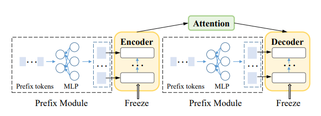

# Few-Shot Code Translation via Task-adapted Prompt Learning

This replication package for our paper “Few-Shot Code Translation via Task-adapted Prompt Learning” includes source code of our model, dataset and results. We hope this artifact can motivate and help future research on code translation and prompt learning.


**Introduction**

Pre-trained models of code such as CodeT5 and TransCoder have shown promising results in code translation. However, fine-tuning a code translation model is challenging due to the scarce availability of parallel code. Large language models such as ChatGPT have exhibited considerable promise in few-shot learning where only a small number of demonstration examples are given to the LLM. However, these models have not been specifically optimized for domain-specific tasks, and
their use often entails significant manual effort in manually curating prompts. In this paper, we propose FSCTrans, a novel approach for code translation that is trained on a small number of demonstration examples. (1) to efficiently reuse prior knowledge during pre-training, FSCTrans employs prompt-based learning, which freezes the pre-trained CodeT5 while merely updating parameters in a small prompt module; (2) to enable prompt learning on only a small number of examples, FSCTrans bridges pre-training to the translation task through a new pre-training objective of code-to-code generation. We evaluate FSCTrans on Java↔Python and Java↔C# datasets from both real-world projects and online judge problems. The evaluation results show that FSCTrans is remarkably effective in few-shot code translation: on average, it improves CodeT5 by 41.4% and 25.56% in terms of BLEU-4 and CodeBLEU; notably, FSCTrans demonstrates 458.7% and 44.7% superior performance in terms of BLEU-4 and CodeBLEU compared to ChatGPT.

**Model Architecture for Prompt Learning**

Instead of merely tuning the embeddings of prompt tokens, we designed a prefix module which prepends a sequence of continuous tasksspecific vectors (prefix) to the input  to affect the activation layers of the
PLMs directly. 

We build FSCTrans based upon CodeT5. Here's our model architecture.



**Prefix Module**

Source code for our prompt learning module is in [model.py](models.py). Source code for training is in [run_gen_prefix.py](sh/run_gen_prefix.py).


**Model Checkpoints**

The original CodeT5 checkpoint can be download from [https://github.com/salesforce/CodeT5#download](https://github.com/salesforce/CodeT5#download). We use the codet5_base. Download it and place it under ***./pretrained_models/codet5_base***

Task adapted CodeT5 checkpoint for java<->cs: [https://drive.google.com/drive/folders/1QtJry9FAjFoYtsxavyA1nNVRo7cRfneQ?usp=sharing](https://drive.google.com/drive/folders/1QtJry9FAjFoYtsxavyA1nNVRo7cRfneQ?usp=sharing). Download it and place it under ***./task_adaption_models/java-cs***

Task adapted CodeT5 checkpoint for java<->python: [https://drive.google.com/file/d/1ka653hGuJqw3-RkrM9p-If6O_1OplyrS/view?usp=sharing](https://drive.google.com/file/d/1ka653hGuJqw3-RkrM9p-If6O_1OplyrS/view?usp=sharing). Download it and place it under ***./task_adaption_models/java-python***

**Data**


Monolingual dataset of Java and Python can be downloaded from [CodeSeachNet](https://github.com/github/CodeSearchNet#downloading-data-from-s3). Monolingual data for C# can be downloaded from [https://drive.google.com/file/d/1Nermx98QW90yYNy4fvfTSycSh0BlVQv2/view?usp=sharing](https://drive.google.com/file/d/1Nermx98QW90yYNy4fvfTSycSh0BlVQv2/view?usp=sharing)

Train/valid/test data is under ***./data_sample_8/translate/.*** The Java - C# pairs are sampled from [CodeXGLUE](https://github.com/microsoft/CodeXGLUE/tree/main/Code-Code/code-to-code-trans), and the Java - Python pairs are from [TransCoder](https://github.com/facebookresearch/TransCoder).

**Results**

We provide translation results by CodeT5 and FSCTrans of our few-shot dataset under ***./Results***

**Usage**

1. First, you need to install our version of Transformers in ***./myTransformers***, following [https://huggingface.co/docs/transformers/installation#editable-install](https://huggingface.co/docs/transformers/installation#editable-install). 
   - As mentioned in the paper, our prefix modules leverage the past_key_values in Transformers to to pass the prefix into CodeT5. To enabling passing labels together with the past_key_values to both Encoder and Decoder of T5ForConditionalGeneration Model in Transformers, we have modified the orginal ***src/transformers/models/t5/modeling_t5.py*** in Transformers.


2. Then download Model Checkpoints and place them under corresponding folders.


3. Go to the ***./sh*** folder. Take the python->java translation as example,
   - FSCTrans: prompt learning on the task-adapted codeT5 model. 
   ```
   python run_exp_softprompt.py --model_tag codet5_base --task translate --sub_task python-java --gpu 0 --gradient_accumulation_steps 1 --filename_end fewshot_8_FSCT --prompt_len 100 --prompt_type 3 --few_shot 8 --patience 300 --epoch 10000 --LMadaption 2
   ```
   - Fine-tuning on the original codeT5:
   ```
   python run_exp_softprompt.py --model_tag codet5_base --task translate --sub_task python-java --gpu 0 --gradient_accumulation_steps 1 --filename_end fewshot_8_finetune --prompt_len 0 --prompt_type 3 --few_shot 8 --patience 300 --epoch 10000
   ```
   - Directly prompt learning on the original codeT5:
   ```
   python run_exp_softprompt.py --model_tag codet5_base --task translate --sub_task python-java --gpu 0 --gradient_accumulation_steps 1 --filename_end fewshot_8_prefix --prompt_len 100 --prompt_type 3 --few_shot 8 --patience 300 --epoch 10000
   ```


**Overall Performance**


